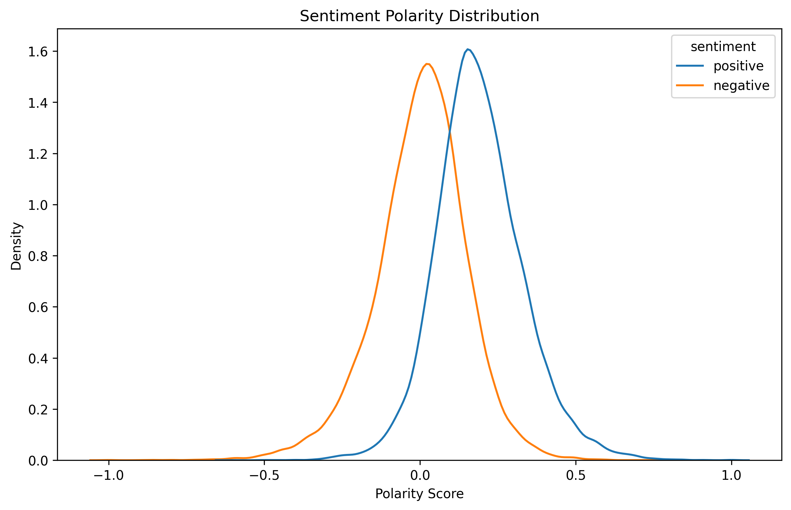
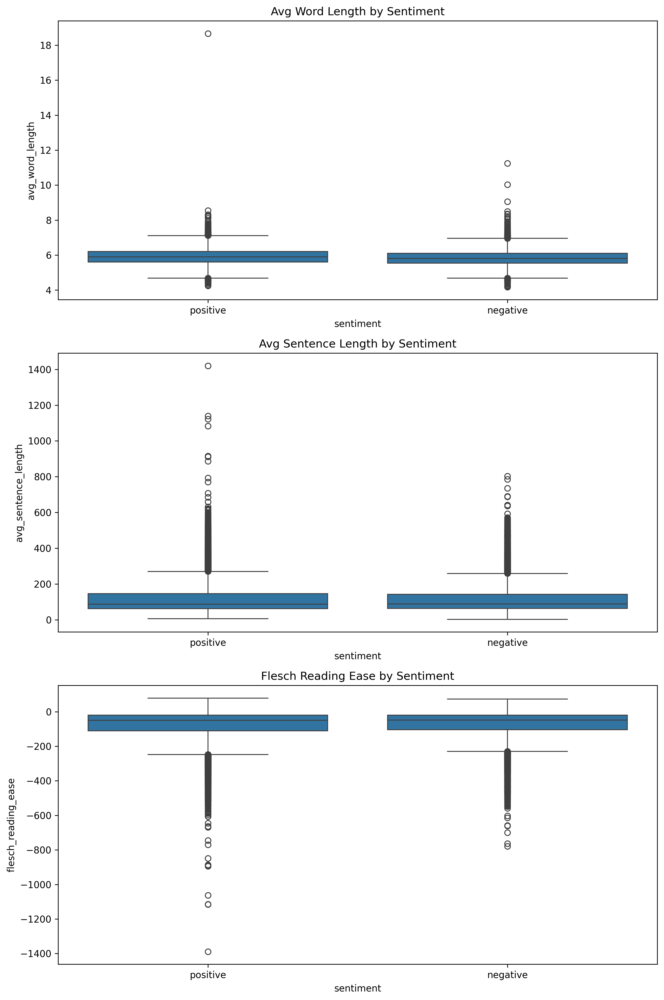
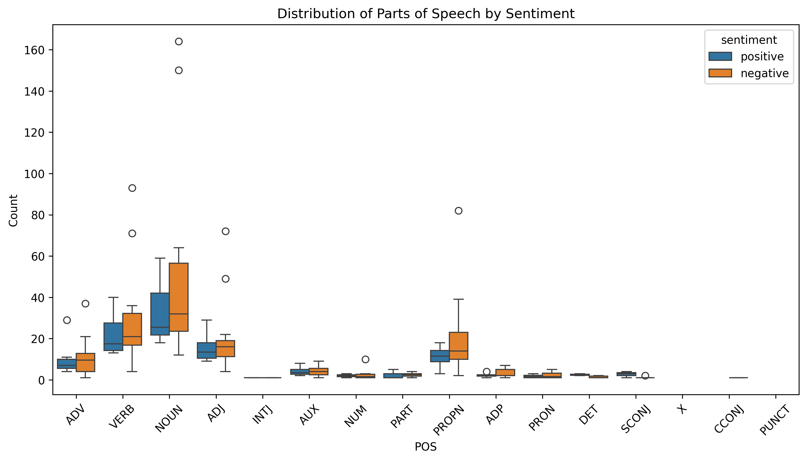

# **IMDB Sentiment Analysis: A Comprehensive Pipeline**

## **Project Overview**
This project performs binary sentiment analysis on the **IMDB Movie Reviews Dataset**. The pipeline is designed to handle end-to-end tasks, including data preprocessing, exploratory data analysis (EDA), feature engineering, feature selection, and sentiment classification using machine learning models. It is optimized for scalability and efficiency, leveraging modern techniques and hardware capabilities (like GPU acceleration on Apple M1 Max).

---

## **Key Features**
1. **Data Preprocessing**:
   - Cleans and normalizes text (removes HTML tags, punctuation, stopwords, etc.).
   - Uses lemmatization for better generalization.

2. **Exploratory Data Analysis (EDA)**:
   - Visualizes character, word, and sentence length distributions.
   - Generates word frequency plots and word clouds.
   - Analyzes sentiment polarity and part-of-speech (POS) distribution.

3. **Feature Engineering**:
   - Implements techniques like Bag-of-Words (BoW), TF-IDF, Standardized TF-IDF, and BM25 variants (BM25, BM25F, BM25L, BM25+, BM25T).
   - Supports skipgrams and positional n-grams.

4. **Feature Selection**:
   - Reduces dimensionality using Chi-Square, Information Gain, Recursive Feature Elimination (RFE), and Correlation-Based methods.

5. **Sentiment Classification**:
   - Trains multiple machine learning models, including:
     - Logistic Regression
     - Support Vector Machines (SVM)
     - Random Forest
     - LightGBM
   - Provides performance evaluation with metrics like accuracy, confusion matrix, and classification report.

6. **Performance Optimization**:
   - Parallelized tasks for faster execution.
   - Supports GPU acceleration on Apple M1 Max.

---

## **Project Structure**
```plaintext
Sentiment_Analysis/
│
├── src/
│   ├── data_loader.py                          # Handles data loading
│   ├── text_preprocessor.py                    # Text preprocessing utilities
│   ├── word_level_feature_engineering.py       # Word Level Feature extraction and transformation
│   ├── feature_selector.py                     # Feature selection methods
│   ├── exploratory_data_analyzer.py            # EDA visualizations and analysis
│   ├── sentiment_analyzer.py                   # Model training and evaluation
│   ├── classification_feature_engineering.py   # Classification Feature extraction and transformation
│   ├── semantic_feature_engineering.py         # Semantic Feature extraction and transformation
│   ├── sentiment_analysis_feature.py           # Sentiment Analysis specific Feature extraction and transformation
│   ├── statistical_feature_engineering.py      # Statistical Feature extraction and transformation
│   ├── syntactic_feature_engineering.py        # Syntactic Feature extraction and transformation
│   ├── contextual_feature_engineering.py       # Contextual Feature extraction and transformation
│   ├── document_level_feature.py               # Document Level feature extracton and transformation
│   ├── character_level_feature_engineering.py  # Character Level feature extraction and transformation
│
├── data/
│   ├── IMDB_Dataset.csv                             # Raw IMDB dataset
│   ├── emotion_lexicon              
│   │   └── NRC-Emotion-Lexicon-Wordlevel-v0.92.txt  # Wordlevel nrc lexicon for emotion dictionaries 
│   └── test_data.csv                                # Test dataset
│
├── notebooks/                       # Containing all jupyter notebooks for experimentation
│
├── results/
│   └── EDA_Results/                 # Generated plots and reports from EDA
│
├── main.py                          # Main script to execute the pipeline
├── config.py                        # Configuration variables stored here
├── README.md                        # Summary of the project and results
├── requirements.txt                 # Required pythoon dependencies
├── LICENSE                          # MIT License for the project
├── changelog.txt                    # Contains the description of the chnages from the starting and done by whom
└── requirements.txt                 # Project dependencies
```
---
## **Setup Instructions**

### **1. Clone the Repository**
```bash
git clone https://github.com/satyaki-itobuz/Sentiment_Analysis.git
cd NLP_Tasks
```

### **2. Install Dependencies**
Use the following command to install all required Python libraries:
```bash
pip install -r requirements.txt
```

### **3. Run the Pipeline**
Execute the pipeline with:
```bash
python run.py
```
---

## **Dataset**
The project uses the IMDB Movie Reviews Dataset:

Source: Kaggle - IMDB Dataset of 50K Movie Reviews
Classes: Positive (pos) and Negative (neg) reviews.

---
## **Results on Word-Level Based Features**
### **1. Model Performance**
#### Logistic Regression
- **Accuracy**: 85.27%

- **Confusion Matrix**:

| Predicted \ Actual | Positive | Negative |
|---------------------|----------|----------|
| Positive           | 4227     | 734      |
| Negative           | 739      | 4300     |

- **Classification Report**:

| Class       | Precision | Recall | F1-Score | Support |
|-------------|-----------|--------|----------|---------|
| Negative    | 0.85      | 0.85   | 0.85     | 4961    |
| Positive    | 0.85      | 0.85   | 0.85     | 5039    |
| **Accuracy**|           |        | **0.85** | 10000   |
| Macro Avg   | 0.85      | 0.85   | 0.85     | 10000   |
| Weighted Avg| 0.85      | 0.85   | 0.85     | 10000   |

- **Accuracy on unseen data**: 71.43%


#### SVM with Polynomial Kernel
- **Accuracy**: 85.26%

- **Confusion Matrix**:

| Predicted \ Actual | Positive | Negative |
|---------------------|----------|----------|
| Positive            | 4001     | 960      |
| Negative            | 514      | 4525     |

- **Classification Report**:

| Class       | Precision | Recall | F1-Score | Support |
|-------------|-----------|--------|----------|---------|
| Negative    | 0.89      | 0.81   | 0.84     | 4961    |
| Positive    | 0.82      | 0.90   | 0.86     | 5039    |
| **Accuracy**|           |        | **0.85** | 10000   |
| Macro Avg   | 0.86      | 0.85   | 0.85     | 10000   |
| Weighted Avg| 0.86      | 0.85   | 0.85     | 10000   |

- **Accuracy on unseen data**: 57.14%


#### SVM with RBF Kernel
- **Accuracy**: 89.81%

- **Confusion Matrix**:

| Predicted \ Actual | Positive | Negative |
|---------------------|----------|----------|
| Positive           | 4416      | 545      |
| Negative           | 474       | 4565     |

- **Classification Report**:

| Class       | Precision | Recall | F1-Score | Support |
|-------------|-----------|--------|----------|---------|
| Negative    | 0.90      | 0.89   | 0.90     | 4961    |
| Positive    | 0.89      | 0.91   | 0.90     | 5039    |
| **Accuracy**|           |        | **0.90** | 10000   |
| Macro Avg   | 0.90      | 0.90   | 0.90     | 10000   |
| Weighted Avg| 0.90      | 0.90   | 0.90     | 10000   |

- **Accuracy on unseen data**: 69.39%


#### SVM with Sigmoid Kernel
- **Accuracy**: 88.82%

- **Confusion Matrix**:

| Predicted \ Actual | Positive | Negative |
|---------------------|----------|----------|
| Positive           | 4368      | 593      |
| Negative           | 525       | 4514     |

- **Classification Report**:

| Class       | Precision | Recall | F1-Score | Support |
|-------------|-----------|--------|----------|---------|
| Negative    | 0.89      | 0.88   | 0.89     | 4961    |
| Positive    | 0.88      | 0.90   | 0.89     | 5039    |
| **Accuracy**|           |        | **0.89** | 10000   |
| Macro Avg   | 0.89      | 0.89   | 0.89     | 10000   |
| Weighted Avg| 0.89      | 0.89   | 0.89     | 10000   |

- **Accuracy on unseen data**: 73.47%


#### Random Forest
- **Accuracy**: 85.21%

- **Confusion Matrix**:

| Predicted \ Actual | Positive | Negative |
|---------------------|----------|----------|
| Positive           | 4271      | 690      |
| Negative           | 789       | 4250     |

- **Classification Report**:

| Class       | Precision | Recall | F1-Score | Support |
|-------------|-----------|--------|----------|---------|
| Negative    | 0.84      | 0.86   | 0.85     | 4961    |
| Positive    | 0.86      | 0.84   | 0.85     | 5039    |
| **Accuracy**|           |        | **0.85** | 10000   |
| Macro Avg   | 0.85      | 0.85   | 0.85     | 10000   |
| Weighted Avg| 0.85      | 0.85   | 0.85     | 10000   |

- **Accuracy on unseen data**: 65.31%


#### Multinomial Naive Bayes
- **Accuracy**: 85.86%

- **Confusion Matrix**:

| Predicted \ Actual | Positive | Negative |
|---------------------|----------|----------|
| Positive           | 4224      | 737      |
| Negative           | 677       | 4362     |

- **Classification Report**:

| Class       | Precision | Recall | F1-Score | Support |
|-------------|-----------|--------|----------|---------|
| Negative    | 0.86      | 0.85   | 0.86     | 4961    |
| Positive    | 0.86      | 0.87   | 0.86     | 5039    |
| **Accuracy**|           |        | **0.86** | 10000   |
| Macro Avg   | 0.86      | 0.86   | 0.86     | 10000   |
| Weighted Avg| 0.86      | 0.86   | 0.86     | 10000   |

- **Accuracy on unseen data**: 81.63%


#### Gaussian Naive Bayes
- **Accuracy**: 83.64%

- **Confusion Matrix**:

| Predicted \ Actual | Positive | Negative |
|---------------------|----------|----------|
| Positive           | 4163      | 798      |
| Negative           | 838       | 4201     |

- **Classification Report**:

| Class       | Precision | Recall | F1-Score | Support |
|-------------|-----------|--------|----------|---------|
| Negative    | 0.83      | 0.84   | 0.84     | 4961    |
| Positive    | 0.84      | 0.83   | 0.84     | 5039    |
| **Accuracy**|           |        | **0.84** | 10000   |
| Macro Avg   | 0.84      | 0.84   | 0.84     | 10000   |
| Weighted Avg| 0.84      | 0.84   | 0.84     | 10000   |

- **Accuracy on unseen data**: 85.71%


#### Gradient Boosting
- **Accuracy**: 81.34%

- **Confusion Matrix**:

| Predicted \ Actual | Positive | Negative |
|---------------------|----------|----------|
| Positive           | 3788      | 1173      |
| Negative           | 693       | 4346     |

- **Classification Report**:

| Class       | Precision | Recall | F1-Score | Support |
|-------------|-----------|--------|----------|---------|
| Negative    | 0.85      | 0.76   | 0.80     | 4961    |
| Positive    | 0.79      | 0.86   | 0.82     | 5039    |
| **Accuracy**|           |        | **0.81** | 10000   |
| Macro Avg   | 0.82      | 0.81   | 0.81     | 10000   |
| Weighted Avg| 0.82      | 0.81   | 0.81     | 10000   |

- **Accuracy on unseen data**: 65.31%


#### Adaptive Boosting (AdaBoost)
- **Accuracy**: 81.34%

- **Confusion Matrix**:

| Predicted \ Actual | Positive | Negative |
|---------------------|----------|----------|
| Positive           | 3788      | 1173      |
| Negative           | 693       | 4346      |

- **Classification Report**:

| Class       | Precision | Recall | F1-Score | Support |
|-------------|-----------|--------|----------|---------|
| Negative    | 0.85      | 0.76   | 0.80     | 4961    |
| Positive    | 0.79      | 0.86   | 0.82     | 5039    |
| **Accuracy**|           |        | **0.81** | 10000   |
| Macro Avg   | 0.82      | 0.81   | 0.81     | 10000   |
| Weighted Avg| 0.82      | 0.81   | 0.81     | 10000   |

- **Accuracy on unseen data**: 67.35%


#### LightGBM
- **Accuracy**: 86.09%

- **Confusion Matrix**:

| Predicted \ Actual | Positive | Negative |
|---------------------|----------|----------|
| Positive           | 4210      | 751      |
| Negative           | 640       | 4399     |

- **Classification Report**:

| Class       | Precision | Recall | F1-Score | Support |
|-------------|-----------|--------|----------|---------|
| Negative    | 0.87      | 0.85   | 0.86     | 4961    |
| Positive    | 0.85      | 0.87   | 0.86     | 5039    |
| **Accuracy**|           |        | **0.86** | 10000   |
| Macro Avg   | 0.86      | 0.86   | 0.86     | 10000   |
| Weighted Avg| 0.86      | 0.86   | 0.86     | 10000   |

- **Accuracy on unseen data**: 73.47%


#### Logistic Decision Tree
- **Accuracy**: 

- **Confusion Matrix**:

| Predicted \ Actual | Positive | Negative |
|---------------------|----------|----------|
| Positive           | 4210      | 751      |
| Negative           | 640       | 4399     |

- **Classification Report**:

| Class       | Precision | Recall | F1-Score | Support |
|-------------|-----------|--------|----------|---------|
| Negative    | 0.87      | 0.85   | 0.86     | 4961    |
| Positive    | 0.85      | 0.87   | 0.86     | 5039    |
| **Accuracy**|           |        | **0.86** | 10000   |
| Macro Avg   | 0.86      | 0.86   | 0.86     | 10000   |
| Weighted Avg| 0.86      | 0.86   | 0.86     | 10000   |

- **Accuracy on unseen data**: 


### Multi-Layer Perceptron
- **Accuracy**: 88.76%

- **Confusion Matrix**:

| Predicted \ Actual | Positive | Negative |
|---------------------|----------|----------|
| Positive           | 4357      | 604      |
| Negative           | 520       | 4519     |

- **Classification Report**:

| Class       | Precision | Recall | F1-Score | Support |
|-------------|-----------|--------|----------|---------|
| Negative    | 0.89      | 0.88   | 0.89     | 4961    |
| Positive    | 0.88      | 0.90   | 0.89     | 5039    |
| **Accuracy**|           |        | **0.89** | 10000   |
| Macro Avg   | 0.89      | 0.89   | 0.89     | 10000   |
| Weighted Avg| 0.89      | 0.89   | 0.89     | 10000   |

- **Accuracy on unseen data**: 73.47%

## **Results after adding Context-Level Features with Word-Level Features**
### **1. Model Performance**
#### Logistic Decision Tree
- **Accuracy**: 72.40%

- **Confusion Matrix**:

| Predicted \ Actual | Positive | Negative |
|---------------------|----------|----------|
| Positive           | 1452      | 596      |
| Negative           | 508       | 1444     |

- **Classification Report**:        

| Class        | Precision | Recall | F1-Score | Support |
|--------------|-----------|--------|----------|---------|
| Negative     | 0.74      | 0.71   | 0.72     |  2048   |
| Positive     | 0.71      | 0.74   | 0.72     |  1952   |
| **Accuracy** |           |        | **0.72** |  4000   |
| Macro Avg    | 0.72      | 0.72   | 0.72     |  4000   |
| Weighted Avg | 0.72      | 0.72   | 0.72     |  4000   |

- **Accuracy on Unseen Data** : 61.22%


#### Logistic Gaussian Naive Bayes
- **Accuracy**: 82.43%

- **Confusion Matrix**:

| Predicted/Actual |  Positive | Negative |
|—————————---------|------—————|——----———-|
| Positive         | 1663      | 385      |
| Negative         | 318       | 1634     |

- **Classification Report**:

| Class        | Precision | Recall | F1-score | support |
|————————------|——-----———-|—----——-|———-----——|———-----—|
| Negative     | 0.84      | 0.81   | 0.83     | 2048    |
| Positive     | 0.81      | 0.84   | 0.82     |  1952   |
| **Accuracy**             |        | **0.82** |  4000   |
| Macro Avg    | 0.82      | 0.82   | 0.82     |  4000   |
| Weighted Avg | 0.82      | 0.82   | 0.82     | 4000    |

- **Accuracy on Unseen Data** : 83.67%


#### Gaussian Naive Bayes
- **Accuracy**: 0.8243

- **Confusion Matrix**:

| Predicted/Actual |  Positive | Negative |
|—————————---------|——------———|———----——-|
| Positive         | 1663      | 385      |
| Negative         | 318       | 1634     |

- **Classification Report**:

| Class        | Precision | Recall | F1-score | Support |
|———————------—|—————------|——----—-|-----—————|———-----—|
| Negative     | 0.84      | 0.81   | 0.83     | 2048    |
| Positive     | 0.81      | 0.84   | 0.82     | 1952    |
| **Accuracy** |           |        | **0.82** | 4000    |
| Macro Avg    | 0.82      | 0.82   | 0.82     | 4000    |
| Weighted Avg | 0.82      | 0.82   | 0.82     | 4000    |

- **Accuracy on Unseen Data** : 83.67%


#### Multilayer Perceptron
- **Accuracy**: 0.8735

- **Confusion Matrix**:

| Predicted/Actual |  Positive | Negative |
|—————————---------|——------———|———----——-|
| Positive         | 1761      | 287      |
| Negative         | 219       | 1733     |

- **Classification Report**:

| Class        | Precision | Recall | F1-score | Support |
|———————------—|—————------|——----—-|-----—————|———-----—|
| Negative     | 0.89      | 0.86   | 0.87     | 2048    |
| Positive     | 0.86      | 0.89   | 0.87     | 1952    |
| **Accuracy** |           |        | **0.87** | 4000    |
| Macro Avg    | 0.87      | 0.87   | 0.87     | 4000    |
| Weighted Avg | 0.87      | 0.87   | 0.87     | 4000    |

- **Accuracy on Unseen Data** : 0.8163


#### Adaptive Boosting (Adaboost)
- **Accuracy**: 73.68%

- **Confusion Matrix**:

| Predicted/Actual |  Positive | Negative |
|—————--------————-|—------————|———----——-|
| Positive         | 1354      | 694      |
| Negative         | 359       | 1593     |

- **Classification Report**:

| Class        | Precision | Recall | F1-Score | Support |
|————————------|—————------|——----—-|—-----————|————----—|
| Negative     | 0.79      | 0.66   | 0.72     | 2048    |
| Positive     | 0.70      | 0.82   | 0.75     | 1952    |
| **Accuracy** |           |        | **0.74** | 4000    |
| Macro Avg    | 0.74      | 0.74   | 0.74     | 4000    |
| Weighted Avg | 0.74      | 0.74   | 0.74     | 4000    |

- **Accuracy on Unseen Data** : 65.31%


#### SVM with RBF kernel
- **Accuracy**: 88.45%

- **Confusion Matrix**:

| Predicted/Actual |  Positive | Negative |
|—————————---------|—------————|—----————-|
| Positive         | 1757      | 291      |
| Negative         | 171       | 1781     |

- **Classification Report**:

| Class        | Precision | Recall | F1-Score | Support |
|————————------|—————------|——----—-|——-----———|—----————|
| Negative     | 0.91      | 0.86   | 0.88     | 2048    |
| Positive     | 0.86      | 0.91   | 0.89     | 1952    |
| **Accuracy** |           |        | **0.88** | 4000    |
| Macro Avg    | 0.89      | 0.89   | 0.88     | 4000    |
| Weighted Avg | 0.89      | 0.88   | 0.88     | 4000    |

- **Accuracy on Unseen Data** : 57.14%


### **2. Visualizations**
#### Sentiment Intensity across reviews : 
#### Word frequency analysis : 
#### Word Cloud By Sentiment Class : 
#### Readability Metrics : 
#### Part of Speech Distribution : 

---

## **Optimization Techniques**
- Parallelized Preprocessing: Utilizes multiprocessing for faster text cleaning.
- Sparse Matrices: Efficiently stores vectorized features.
- GPU Acceleration: For training models using LightGBM and TensorFlow.
- Batch Processing: Reduces memory overhead for large datasets.

---

## **How to Extend**
1. Add Neural Networks: Implement sentiment classification with pre-trained transformers (e.g., BERT).
2. Deploy as a Web App: Use Flask or FastAPI to serve the model.
3. Real-Time Updates: Integrate with APIs to fetch real-time reviews.


## **Contributors**
Satyaki Mitra - Lead Developer

